# Agent Service

The **Agent Service** is the core intelligence engine of the AI Agents platform. It leverages **LangGraph** and **LangChain** to orchestrate complex agent behaviors, managing execution flows, tool calls, and state persistence.

## 🚀 Features

- **LangGraph orchestration**: Manages complex agent workflows with nodes like `planning`, `tool_node`, `llm_call`, etc.
- **Real-time Streaming**: Uses Server-Sent Events (SSE) to stream agent thoughts, tool results, and final answers to the client.
- **Execution Tracking**: detailed logging of every step, node execution, and state change in MongoDB.
- **Dynamic Configuration**: specific agent nodes (prompts, models) can be configured dynamically via API.

## 🧠 Agent Architecture

The following diagram illustrates the high-level design of the agent execution flow, including the planning phase, execution loop, and state transitions.

```mermaid
graph TD
    START((START)) --> Router{needsPlanning?<br/>Model: gemini-2.0-flash-lite}

    %% Planning Phase & Research Loop
    Router -- "No Req / Empty" --> LLM[LLM Call <br/> Decision Node <br/> Model: gemini-2.5-flash-lite]
    Router -- COMPLEX --> Planning[Planning Node <br/> Model: gemini-2.5-flash-lite]
    Router -- SIMPLE --> LLM
    
    Planning -- "Ready to Plan" --> LLM
    Planning -- "Need Info (Research)" --> Tool[Tool Node]

    %% Main Execution Loop
    LLM --> Check{shouldContinue?}
    
    %% Branches from Decision
    Check -- "Msg > 12 OR <br/> Size > 200k & Msg > 5" --> Summarize[Summarize Node <br/> Model: gemini-2.0-flash-lite]
    Check -- "tool_call" --> Tool
    Check -- "ready_to_reply" --> Final[Final Answer Node <br/> Model: gemini-2.5-flash-lite]
    Check -- "Steps >= 30 <br/> or No Msg" --> END((END))
    
    %% Tool Execution & Replanning & Research Return
    Tool --> ReplanCheck{shouldReplan?}
    ReplanCheck -- "Researching (No Plan)" --> Planning
    ReplanCheck -- "Execution Success" --> LLM
    ReplanCheck -- "Failure >= 2 <br/> Loop Detected <br/> Steps >= 20" --> Replanner[Replanner Node <br/> Model: gemini-2.5-flash-lite]
    Replanner -- "New Plan" --> LLM
    
    %% Summarization Loop
    Summarize -- "Context Compressed" --> LLM
    
    %% Terminal States
    Final --> END
    
    %% Styling
    classDef plain fill:#000,stroke:#333,stroke-width:1px;
    classDef special fill:#000,stroke:#01579b,stroke-width:2px;
    classDef term fill:#000,stroke:#333,stroke-width:2px;
    
    class Planning,LLM,Tool,Replanner,Summarize,Final plain;
    class Router,Check,ReplanCheck special;
    class START,END term;
```



## 🛠️ Technology Stack

- **Runtime**: Node.js, Express
- **AI Framework**: LangChain, LangGraph
- **Database**: MongoDB (via Mongoose)
- **Validation**: Zod
- **Logging**: Winston

## 📦 Installation & Setup

1.  **Install dependencies**:
    ```bash
    npm install
    ```

2.  **Environment Variables**:
    Create a `.env` file in the root of the service:
    ```env
    PORT=3006
    MONGO_URI=mongodb://localhost:27017/ai-agents
    OPENAI_API_KEY=sk-...
    # Add other model providers as needed
    ```

3.  **Run Development Server**:
    ```bash
    npm run dev
    ```
    The server will start at `http://localhost:3006`.

## 🔌 API Reference & Curl Examples

### 1. Execute Agent (Streaming)

Starts a new agent execution stream for a given conversation.

- **Endpoint**: `POST /execute/:conversationId`
- **Headers**:
  - `Content-Type: application/json`
  - `x-user-id: <user_id>`
- **Body**:
  - `message`: User's input text.
  - `attachments`: (Optional) Array of `{name, url}`.

**Curl Example:**

```bash
curl -N -X POST http://localhost:3006/execute/conv_12345 \
  -H "Content-Type: application/json" \
  -H "x-user-id: user_001" \
  -d '{
    "message": "Research the current stock price of Apple vs Microsoft",
    "attachments": []
  }'
```

*> Note: The `-N` flag in curl is important to see the streamed response immediately.*

### 2. List Executions

Retrieve a list of past agent executions with optional filtering.

- **Endpoint**: `GET /executions`
- **Query Params**:
  - `status` (optional): `RUNNING`, `SUCCESS`, `STOPPED`, `ERROR`
  - `limit`: (default 20)
  - `skip`: (default 0)

**Curl Example:**

```bash
curl "http://localhost:3006/executions?status=SUCCESS&limit=5"
```

### 3. Get Execution Details

Get high-level details about a specific execution ID.

- **Endpoint**: `GET /executions/:id`

**Curl Example:**

```bash
curl http://localhost:3006/executions/exec_98765
```

### 4. Get Execution Nodes

Get the detailed step-by-step node executions for a specific run.

- **Endpoint**: `GET /executions/:id/nodes`

**Curl Example:**

```bash
curl http://localhost:3006/executions/exec_98765/nodes
```

### 5. Stop Execution

Manually stop a running agent execution.

- **Endpoint**: `POST /stop/:id`

**Curl Example:**

```bash
curl -X POST http://localhost:3006/stop/exec_98765
```

### 6. Get Node Configurations

List all configurable nodes (prompts/models) for the agent.

- **Endpoint**: `GET /agent-nodes`

**Curl Example:**

```bash
curl http://localhost:3006/agent-nodes
```

### 7. Update Node Configuration

Update the configuration (e.g., prompt template) for a specific node.

- **Endpoint**: `PUT /agent-nodes/:nodeName`
- **Body**: Fields to update (e.g., `promptTemplate`, `modelConfig`).

**Curl Example:**

```bash
curl -X PUT http://localhost:3006/agent-nodes/planning \
  -H "Content-Type: application/json" \
  -d '{
    "config": {
      "model": "gpt-4-turbo",
      "temperature": 0.5
    }
  }'
```

## 💓 Health Checks

- **Server Health**: `GET /health`
- **Database Health**: `GET /db-health`
